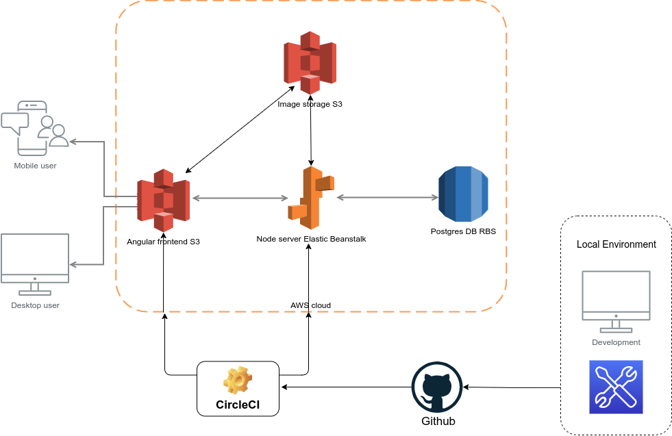
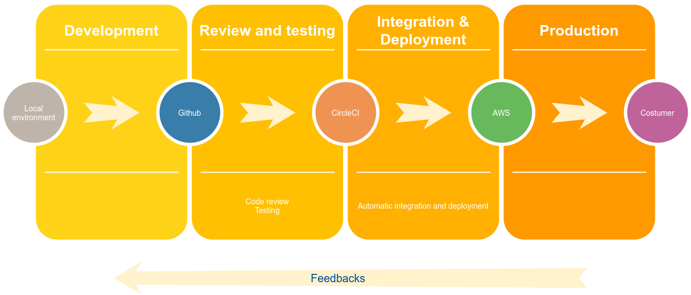

## Infrastructure
The development enviroment includes:
```
* Local environment for develop.
* Github repository to store the codebase
* Circle CI to automate the CI/CD
```
The production environment are based on AWS services:
```
* The Postgres database is available with AWS RDS.
* The uploaded files are available in a AWS S3 Bucket.
* The Frontend server is hosted in a AWS S3 Bucket.
* The API server is available in AWS Elastic Beanstalk.
```


## Pipeline process
```
* The application code is sending to the Github
* After review and tests, the aproved code is sended from Github to CircleCI
* Circle CI allow the automation of building and deploy in AWS Cloud
* AWS allow to host the server in the cloud and bring the service to the costumer 
```



## App dependencies
- NodeJS
- npm

### Frontend
- Angular 
- Ionic
- Typescript

### Backend
- ExpressJS
- Sequelize
- AWS-sdk
- S3 bucket for hosting uploaded pictures.
### DB
- RDS database with Postgres DB

### Deployment
- AWS CLI
- EB CLI

### Environment variables

```
RDS_USERNAME, RDS_PASSWORD, 
RDS_DB_NAME, RDS_PORT, RDS_HOSTNAME, 
PORT, AWS_DEFAULT_REGION, AWS_PROFILE, 
AWS_BUCKET, AWS_MEDIA_BUCKET, URL, JWT_SECRET, 
AWS_ACCESS_KEY_ID, AWS_SECRET_ACCESS_KEY
```
